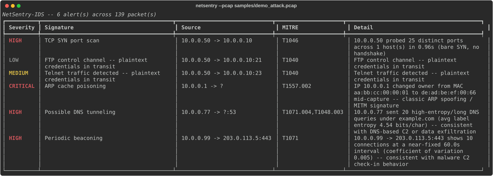

# NetSentry-IDS

A network intrusion detection engine that combines a custom Snort-style signature
language with four stateful anomaly detectors, over both offline packet
captures and live interfaces. Every finding is tagged with a [MITRE
ATT&CK](https://attack.mitre.org/) technique ID, the way findings get
reported in an actual SOC.

```
$ python -m netsentry --pcap samples/demo_attack.pcap
```



## Why this exists

Most student IDS projects wrap Suricata or Zeek and call it a day. This one
implements the detection logic itself: a hand-rolled signature rule parser
and matcher, and four anomaly detectors built from first principles (sliding
time windows, Shannon entropy, coefficient of variation on timing intervals).
The goal was to understand *why* an IDS flags what it flags, not just to run
one.

## What it detects

| Detector | Technique | MITRE ATT&CK | Method |
|---|---|---|---|
| Signature engine | arbitrary (rule-defined) | rule-defined | Snort-like rule matching on proto/IP/port/flags/payload/TTL |
| `port_scan` | TCP SYN port scanning | [T1046](https://attack.mitre.org/techniques/T1046/) / [T1595.001](https://attack.mitre.org/techniques/T1595/001/) | clusters bare SYNs from one source into time-bounded bursts, flags when distinct destination ports in a burst exceed a threshold |
| `arp_spoof` | ARP cache poisoning | [T1557.002](https://attack.mitre.org/techniques/T1557/002/) | tracks IP→MAC bindings from ARP replies, flags when one IP is claimed by a second, different MAC |
| `dns_tunnel` | DNS tunneling / exfiltration | [T1071.004](https://attack.mitre.org/techniques/T1071/004/) / [T1048.003](https://attack.mitre.org/techniques/T1048/003/) | Shannon entropy + length of query labels, grouped by (source, base domain), flags sustained high-entropy query volume |
| `beaconing` | C2 check-in traffic | [T1071](https://attack.mitre.org/techniques/T1071/) | coefficient of variation on inter-connection intervals per (src, dst, port) flow, flags low-jitter periodicity |

The shipped [`rules/signatures.rules`](rules/signatures.rules) file has 11
example signatures (reverse-shell ports, plaintext-credential protocols,
path-traversal payloads, oversized ICMP, etc.) written in the DSL documented
in [`netsentry/rules.py`](netsentry/rules.py).

## Architecture

```
                    ┌──────────────────┐
  .pcap file  ──────▶                  │
                    │  netsentry.packets │──▶ PacketRecord (flat, protocol-
  live interface ───▶  (scapy-backed)   │    agnostic normalized form)
                    └──────────────────┘
                              │
                 ┌────────────┴────────────┐
                 ▼                         ▼
        ┌─────────────────┐      ┌─────────────────────┐
        │   RuleEngine     │      │   4x Detector        │
        │ (netsentry.rules)│      │ (netsentry.detectors) │
        └─────────────────┘      └─────────────────────┘
                 │                         │
                 └────────────┬────────────┘
                               ▼
                     NetSentryEngine.run()
                               │
                               ▼
                     list[Alert] (severity, MITRE
                     technique, evidence dict)
                               │
                     ┌─────────┴─────────┐
                     ▼                   ▼
              Rich terminal table   newline-delimited JSON
```

Every packet is normalized once, into `PacketRecord`
([`netsentry/packets.py`](netsentry/packets.py)) -- a flat dataclass with no
scapy types in it. Detectors and the rule engine only ever see
`PacketRecord`s, which is what makes them independently unit-testable
without a live capture in the loop.

## Quickstart

```bash
pip install -r requirements.txt

# analyze the bundled synthetic demo capture (benign traffic + one instance
# of every detected attack pattern)
python -m netsentry --pcap samples/demo_attack.pcap

# JSON output, piped into jq
python -m netsentry --pcap samples/demo_attack.pcap --json | jq .

# live capture (needs root / CAP_NET_RAW)
sudo python -m netsentry --iface eth0 --timeout 60

# anomaly detectors only, no signature engine
python -m netsentry --pcap samples/demo_attack.pcap --no-rules
```

Exit code is `1` if any alert fired, `0` otherwise -- convenient for CI or a
cron job (`netsentry --pcap nightly.pcap --min-severity high || page_oncall`).

## The demo capture

[`samples/demo_attack.pcap`](samples/demo_attack.pcap) is entirely synthetic
-- generated by [`netsentry/testkit.py`](netsentry/testkit.py) with a fixed
random seed, not captured from any real network. It's the same generator the
test suite uses, so the ground truth is always known. Regenerate it with:

```bash
python3 samples/make_demo_pcap.py
```

## Testing

26 tests, all built on the same synthetic-traffic generators as the demo
capture -- no external `.pcap` samples or network access required.

```bash
pip install -r requirements.txt pytest
python -m pytest tests/ -v
```

Coverage includes: rule-DSL parsing and matching (header syntax, CIDR
sources, content/dsize/flags/ttl options), each detector in isolation
against both its attack pattern and benign traffic (to catch false
positives, not just true positives), a real on-disk pcap round trip
(`rdpcap` → detectors, not just in-memory scapy objects), and CLI subprocess
smoke tests for both the alerting and clean-exit paths.

## Design notes / limitations

- **Detectors are heuristic, not proof.** Every threshold (15 ports/10s for
  port scans, entropy ≥ 3.6 bits/char for DNS tunneling, CV ≤ 0.15 for
  beaconing) is a tunable constructor argument, chosen to separate the
  synthetic attack traffic from synthetic benign traffic in this repo's test
  suite. A production deployment would tune these against real baseline
  traffic and expect a nonzero false-positive rate, like any anomaly-based
  IDS.
- **Offline-first.** Live capture works (`--iface`) but needs raw-socket
  privileges; the primary, fully-tested path is offline `.pcap` analysis,
  which is also how most real IDS rule development and incident response
  actually happens (analyzing a capture after the fact).
- **The rule DSL is intentionally small.** It covers proto/IP/CIDR/port
  ranges, TCP flags, payload substring + case-insensitivity, payload size,
  and TTL comparisons -- enough to express real signatures, not a full Snort
  reimplementation (no PCRE, no flowbits, no stream reassembly).

## Project layout

```
netsentry/
  packets.py       packet ingestion + normalization (scapy -> PacketRecord)
  rules.py          signature DSL parser + matcher
  alerts.py          Alert / Severity model
  engine.py           orchestrates rules + detectors, sorts + summarizes
  testkit.py           synthetic traffic generators (shared by tests + demo)
  detectors/
    port_scan.py        TCP SYN scan burst detection
    arp_spoof.py          ARP cache poisoning detection
    dns_tunnel.py          entropy-based DNS tunneling detection
    beaconing.py            periodic C2 check-in detection
rules/signatures.rules   example signature set
samples/                  demo pcap + its generator script
tests/                     26 tests (unit + end-to-end + CLI)
docs/demo-alerts.svg        rendered terminal output for this README
```

## License

MIT
